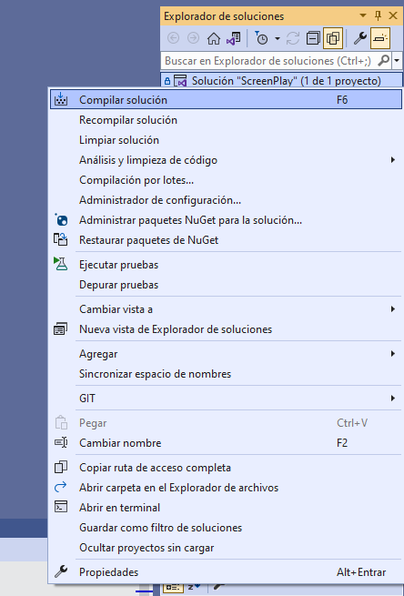

## ScreenPlay C#

**Class Diagram**

## Requerimientos para ejecutar los test

**Instalar Visual Studio 2022**
- Link de descarga: https://visualstudio.microsoft.com/es/launch/

**Descargar dependencias del proyecto**
- Click derecho en la solución
- Click en opción "Restaurar paquetes de Nuget"

**Compilar proyecto**
- Click derecho en la solución
- Click en opción "Compilar solucion"

**Ejecutar test**
- Abrir Explorador de pruebas

- Seleccionar opción de Ejecutar Prueba

